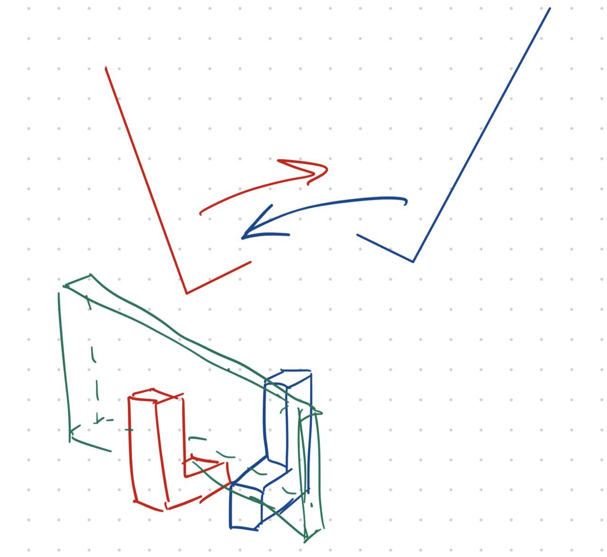

# IHD F23 - Homework 1 - Lev Kozlov

# Task 1

In this task I have designed a 4-link bar mechanism. Actually two of them, they are synchronized in the point A. I was inspired by this [video](https://www.youtube.com/watch?v=KCJa2zRWpwg).

In this sample the workpiece is picked at the left and moved to the right. I assume that there is 3rd dimension (no anime) and the workpiece is lying on some rails for easier pick up.

# Task 2 & 3

I have managed to do both 2nd and 3rd tasks with one design of 6-bar mechanism.

In this example the workpiece is located at the green line and is moved from right to left. I have designed the first part (rotation from right to the middle) and then basically mirrored the rest of mechanism. The lengths of links where the workpiece is moved have enough space for both different types of workpieces.

Regarding task 3 it is a quick-return mechanism because it takes about 160 degrees of crank to move one part of cycle of "end effector".

# Task 4

In this task I have designed a 6-bar mechanism driven by pneumatic actuator. A0-A link is the retracted length of the actuator, while AB is the extended length.

The workpiece is moved from right to left and I assume it lies on the rails on the red line.

# Idea:

I would like to describe the idea of how the workpiece is moved from one part of mechanism to another:

I assume that in third dimension left and and right part of mechanism do not collide with each other. It will allow to one part of mechanism to hold the piece while second will pick it up.

_In real world there should be at least a pair of red-blue holders not to lose the detail_

Also, in geogebra animation I have tried to draw where applicable such additional links for clarity.

# Conclusion:

Actually, for most of the tasks the most important idea of flipping was to divide the procedure into two parts: flip to the middle and then flip to the end.

I have tried to apply nonlinear programming to synthesise mechanisms at first, but it not only overkill, but was hard to configure. You may see those attempts in [this notebook](task1-4link.ipynb)
