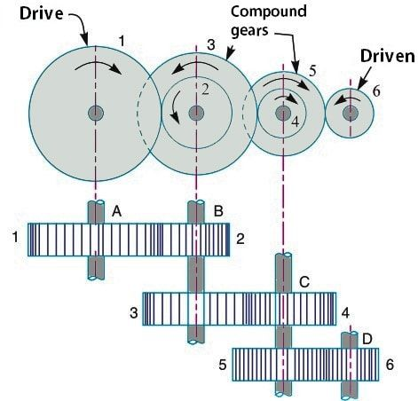

# Task

Calculate the ratios for a compound gear train similar to the one shown in the picture:

Design a gear ratio of 1:200

Calculate the number of stages.

Select pinion size.

Select gear size(s) with a maximum of 2 different sizes.

# Solution

## Number of stages

It is suggested to not exceed 1:10 ratio in one stage.

1. 2 stages $\implies$ $\sqrt{200}$ = 14.14
1. 3 stages $\implies$ $\sqrt[3]{200}$ = 5.848

## Pinion

- We have 3 stages and required ratio of 1:200
- Look up to the table and find the combination giving the closest ratio to 5.848

| Gear | Ratio | Pinion |
| ---- | ----- | ------ |
| 13   | 5.848 | 76.024 |
| 12   | 5.848 | 70.176 |
| 11   | 5.848 | 64.328 |
| 10   | 5.848 | 58.48  |

- Note, that I compute the ratio backward as we try to reduce the ratio of overall gearset.
- Gear 13 gives gear pretty close to integer.
- If pinion 76 and gear 13 are chosen, then after 3 stages the ratio will be 0.005004829
- Original required ratio 1:200 is 0.005
- Error between them is less than 0.1%.

## Conclusion:

Given calculations above it is clear that the best combination is to have 3 stages with pinions 76 and gears 13 consequently to achieve the required ratio of 1:200.
